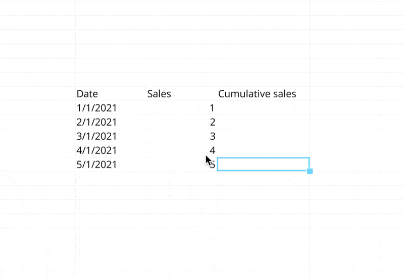

# Getting started

Get started with Formulas the same way as any other spreadsheet - click `=` on a cell and get started right away. Formulas are in-line by default.&#x20;

<figure><figcaption><p>In-line formulas in Quadratic</p></figcaption></figure>

You can also optionally use multi-line Formulas for those Formulas that need to be expanded to become readable.&#x20;

To open the multi-line editor either use / and select it in the cell type selection menu or use the multi-line editor button from the in-line editor as showed below.&#x20;

<figure><figcaption></figcaption></figure>

The multi-line editor becomes useful when Formulas become more difficult to read than the space afforded by the in-line editor. Example:

```sql
IF( Z0 > 10, 
    IF( Z1 > 10, 
        IF (Z2 > 10, 
            AVERAGE(Z0:Z2), 
            "Invalid Data",
        ),
        "Invalid Data", 
    ),
    "Invalid Data", 
)
```

Cells are by default referenced relatively in Quadratic. Use $ notation to do absolute references, similar to what you'd be familiar with in traditional spreadsheets. Learn more on the [reference-cells.md](reference-cells.md "mention") page.

<table data-view="cards"><thead><tr><th></th><th></th><th></th><th data-hidden data-card-target data-type="content-ref"></th></tr></thead><tbody><tr><td></td><td>Jump to: <br><span data-gb-custom-inline data-tag="emoji" data-code="1f449">👉</span> <strong>Reference cells</strong></td><td></td><td><a href="reference-cells.md">reference-cells.md</a></td></tr><tr><td></td><td>Jump to: <br><span data-gb-custom-inline data-tag="emoji" data-code="1f4dc">📜</span> <strong>Formulas cheat sheet</strong></td><td></td><td><a href="functions-and-operators.md">functions-and-operators.md</a></td></tr><tr><td></td><td></td><td></td><td></td></tr></tbody></table>
