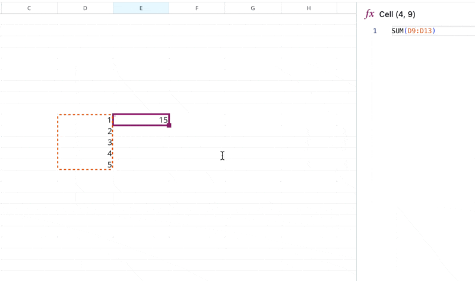

# Reference cells

## 1. Reference an individual cell

To reference an individual cell, use standard spreadsheet notation. The only difference is that Quadratic allows negative axes; for negative notation, append `n` to the cell reference. Cells are, by default, relatively referenced. Use `$` notation to use absolute references.&#x20;

**Examples in the table below:**

<table><thead><tr><th width="219">Formula Notation</th><th>(x, y) coordinate plane equivalent </th><th data-hidden>(x, y) coordinate plane equivalent</th><th data-hidden></th></tr></thead><tbody><tr><td><code>A0</code></td><td>(0,0)</td><td>(0</td><td></td></tr><tr><td><code>A1</code></td><td>(0,1)</td><td></td><td></td></tr><tr><td><code>B1</code></td><td>(1,1)</td><td></td><td></td></tr><tr><td><code>An1</code></td><td>(0,-1)</td><td></td><td></td></tr><tr><td><code>nA1</code></td><td>(-1,1)</td><td></td><td></td></tr><tr><td><code>nAn1</code></td><td>(-1,-1)</td><td></td><td></td></tr></tbody></table>

## 2. Relative cell reference&#x20;

Individual cells and ranges are, by default, referenced relatively. E.g. copy-pasting `A1` to the following two rows will produce `A2`, and `A3` respectively.

To reference a range of cells relatively, use the traditional spreadsheet notation that separates two distinct cells using a semicolon as a delimiter, e.g. `A1:D3`

Cells in this notation are referenced relatively, so you can drag out a cell to replicate that formula relatively across your selection.&#x20;

<figure><figcaption></figcaption></figure>

## 3. Absolute cell references

To perform absolute cell references, use standard spreadsheet notation with `$`, for example  `$A$1:D3` - `A1` will be copied absolutely and `D3` will be copied relatively if you drag to replicate.

## 3. Reference across sheets

To reference the value from another sheet, use the sheet name in quotations with an `!`.

### Single cell

To reference cell F12 in a sheet named "Sheet 1" from a sheet named "Sheet 2" use:&#x20;

```formula
"Sheet 1"!F12
```

### Range of cells&#x20;

To reference cells F12 to F14 in Sheet 1 from Sheet 2, use:

```
"Sheet 1"!F12:F14
```
