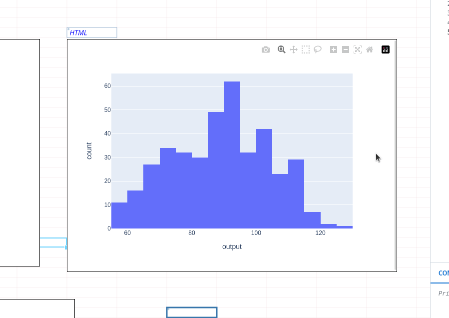

# Charts/visualizations

Create beautiful visualizations using our in-app Plotly support. Plotly support works just as you're used to in Python, displaying your chart straight to the spreadsheet.&#x20;

## Getting started

Building charts in Quadratic is centered around Python charting libraries, starting with Plotly. Building charts in Plotly is broken down into 3 simple steps:&#x20;

1. [Create and display a chart ](charts-visualizations.md#create-and-display-a-chart)
2. [Style your chart ](charts-visualizations.md#styling)
3. [Chart controls](charts-visualizations.md#3.-chart-controls)

## 1. Create and display a chart

### Line charts

```python
# import plotly
import plotly.express as px

# replace this df with your data
df = px.data.gapminder().query("country=='Canada'")

# create your chart type, for more chart types: https://plotly.com/python/
fig = px.line(df, x="year", y="lifeExp", title='Life expectancy in Canada')

# make chart prettier
fig.update_layout(
    plot_bgcolor="White",
)

# display chart 
fig.show()
```

<figure><figcaption></figcaption></figure>

### Bar charts

```python
import plotly.express as px

# replace this df with your data
df = px.data.gapminder().query("country == 'Canada'")

# create your chart type, for more chart types: https://plotly.com/python/
fig = px.bar(df, x='year', y='pop')

# make chart prettier
fig.update_layout(
    plot_bgcolor="White",
)

# display chart
fig.show()
```

<figure><figcaption></figcaption></figure>

### Histograms&#x20;

<pre class="language-python"><code class="lang-python"><strong># Import Plotly
</strong><strong>import plotly.express as px
</strong>
# Create figure - replace df with your data
fig = px.histogram(df, x = 'output')

# Display to sheet 
fig.show()
</code></pre>

<figure><figcaption></figcaption></figure>

### Scatter plots&#x20;

```python
import plotly.express as px

# replace df, x, and y and color with your data
fig = px.scatter(df, x="col1", y="col2", color="col3")
fig.update_traces(marker_size=10)
fig.update_layout(scattermode="group")
fig.show()
```

<figure><figcaption></figcaption></figure>

### Heatmaps

```python
# Import library
import plotly.express as px

# Assumes 2d array Z
fig = px.imshow(Z, text_auto=True)

# Display chart
fig.show()
```

<figure><figcaption></figcaption></figure>

### More chart types

For more chart types, explore the Plotly docs: [https://plotly.com/python/](https://plotly.com/python/)

## 2. Styling

For more styling, explore the Plotly styling docs: [https://plotly.com/python/styling-plotly-express/](https://plotly.com/python/styling-plotly-express/)

```python
# Example chart styling options to get started
fig.update_layout(
    xaxis=dict(
        showline=True,
        showgrid=False,
        showticklabels=True,
        linecolor='rgb(204, 204, 204)',
        linewidth=2,
        ticks='outside',
        tickfont=dict(
            family='Arial',
            size=12,
            color='rgb(82, 82, 82)',
        ),
    ),
    yaxis=dict(
        showgrid=False,
        zeroline=False,
        showline=False,
        showticklabels=True,
    ),
    autosize=False,
    showlegend=False,
    plot_bgcolor='white',
    title='Historical power usage by month (1985-2018)'
)
```

## 3. Chart controls

&#x20;Resize by dragging the edges of the chart.&#x20;

<figure><figcaption></figcaption></figure>
